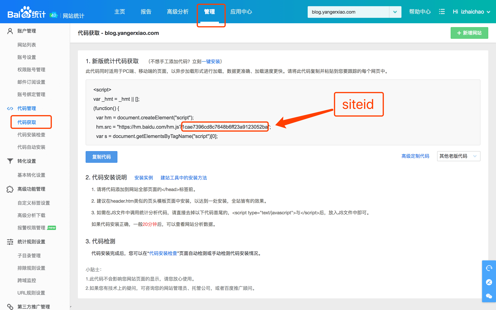

# gatsby-plugin-baidu-analytics
Easily add Baidu Analytics to your Gatsby site.

## Install

`npm install --save gatsby-plugin-baidu-analytics`

## How to use in gatsby


```javascript
// gatsby-config.js
plugins: [
  .
  .
  .
  {
    resolve: `gatsby-plugin-baidu-analytics`,
    options: {
	    // baidu analytics siteId
      siteId: "YOUR_BAIDU_ANALYTICS_SITE_ID",
      // Put analytics script in the head instead of the body [default:false]
      head: false,
    },
  },
  .
  .
  .
];
```

## How to get the `siteId`

